# Splunk Exploring SPL: A Practical SOC Analyst Walkthrough for Search, Detection, and Threat Hunting

**Cybersecurity | Splunk | SIEM | SPL | Threat Hunting | SOC Analysis**

Security analysts deal with overwhelming amounts of telemetry every single day. Authentication logs, process executions, network events, registry modifications, suspicious scripts, everything eventually becomes part of the noise.

Without the ability to efficiently search, filter, and transform that data, incident response becomes painful very quickly.

That is where **Splunk’s Search Processing Language (SPL)** becomes incredibly powerful.

In this walkthrough, I’ll document my practical exploration of the *Splunk Exploring SPL* TryHackMe lab while approaching it from a real-world SOC analyst perspective. Instead of simply solving flags, the focus here is understanding *why* each query matters and how similar workflows apply during actual investigations.

We’ll cover:

* Search & Reporting fundamentals
* SPL operators and filtering logic
* Structuring investigation timelines
* Transforming noisy logs into actionable intelligence
* Threat hunting using anomaly detection
* Practical enrichment techniques for analysts

Let’s jump in.

---

# Understanding Splunk Search & Reporting

Splunk’s **Search & Reporting App** is where analysts spend most of their investigative time.

Core interface components include:

* **Search Head** → Where SPL queries are written
* **Time Picker** → Controls investigation scope
* **Search History** → Useful for revisiting prior searches
* **Data Summary** → Quick overview of available hosts, sources, and sourcetypes

In a real SOC environment, selecting the wrong timeframe can completely distort findings. A suspicious event hidden in "All Time" may immediately stand out in a tighter investigation window.

---

# First Search: Exploring the Dataset

The first step is always understanding what data exists.

Since this lab uses the `windowslogs` index, the natural starting point is a broad search.

## PAYLOAD

```spl
index=windowslogs
```

This query tells Splunk:

* Search the `windowslogs` index
* Return every matching event

Think of an index like a structured data container holding a particular category of logs.

The result:

**12256 total events**

This immediately gives us situational awareness regarding investigation scale.

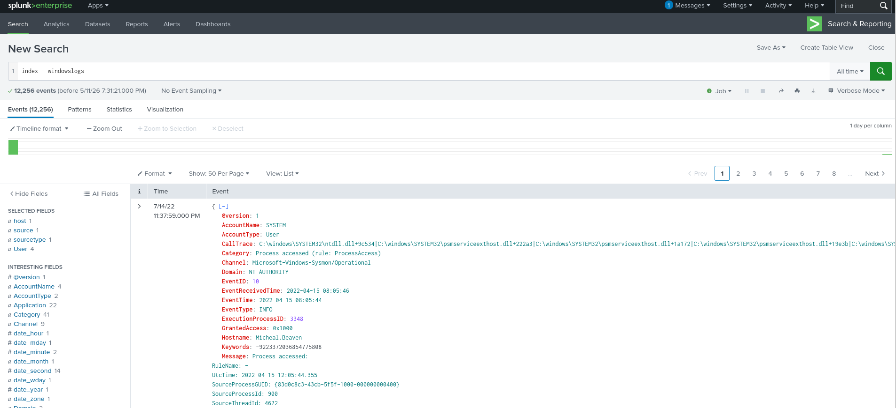

---

# Investigating the Fields Sidebar

One of Splunk’s most useful reconnaissance tools is the **Fields Sidebar**.

Instead of blindly guessing field names, it helps analysts inspect:

* parsed fields
* interesting values
* top-occurring entries
* numeric fields
* string-based fields
* event distributions

This becomes incredibly useful during exploratory threat hunting.

For example, after loading the full dataset, we can inspect:

**More Fields → SourceIP**

to determine which source IP generated the highest activity.

That revealed:

**172.90.12.11**

This kind of quick pivoting is common during triage investigations.

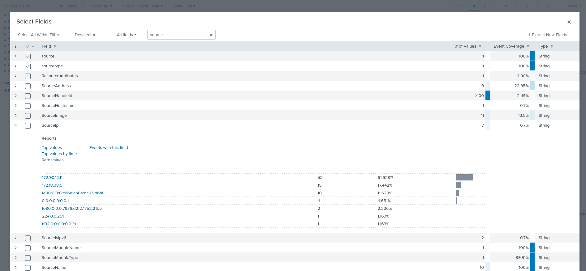

---

# Time-Bounded Event Investigation

Time filtering is one of the most important investigation skills in any SIEM.

Instead of reviewing the entire dataset, the lab required narrowing the scope to:

**04/15/2022 from 08:05 AM to 08:06 AM**

This returned:

**134 events**

A single minute of logs producing over a hundred events is a practical reminder of how noisy enterprise environments can become.

Proper time scoping often makes the difference between efficient investigation and chaos.

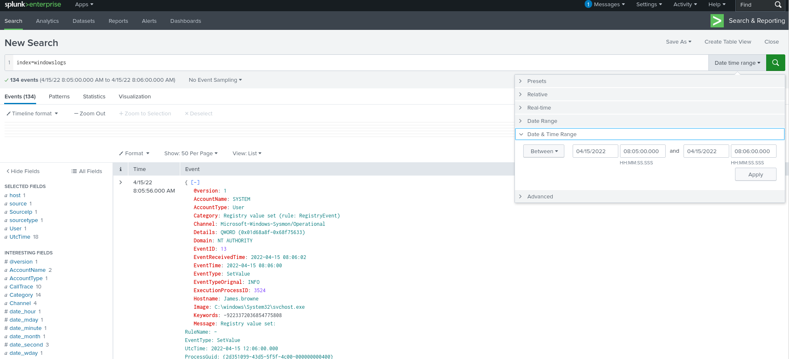

---

# Search Operators in SPL

Searching raw logs is useful, but the real strength of SPL comes from operators.

Operators allow us to:

* compare values
* combine conditions
* exclude noise
* search patterns
* create precise hunting logic

---

# Free Text Search

A quick free-text search looks like this:

## PAYLOAD

```spl
index=windowslogs alice
```

This searches for the keyword:

**alice**

across the indexed events.

Free-text searching is especially useful when:

* exact field names are unknown
* rapid exploratory hunting is needed
* IOC validation begins

This is often the fastest first move during incident triage.

---

# Relational Operators

Splunk supports relational operators such as:

* `=`
* `!=`
* `<`
* `>`
* `<=`
* `>=`

These allow direct comparison-based filtering.

A practical example is excluding noisy system-generated events.

---

# Filtering SYSTEM Account Noise

## PAYLOAD

```spl
index=windowslogs AccountName!=SYSTEM
```

This query:

* searches all Windows logs
* excludes events where `AccountName = SYSTEM`

Why this matters:

SYSTEM accounts generate enormous amounts of legitimate telemetry.

Filtering them helps analysts focus on human-driven activity, where suspicious behavior is usually easier to spot.

---

# Successful Authentication Events

Windows authentication investigations frequently begin with Event IDs.

For successful logons:

## PAYLOAD

```spl
index=windowslogs EventID=4624
```

Event ID:

**4624 = Successful Logon**

This returned:

**26 events**

This query is directly relevant for:

* authentication investigations
* brute-force review
* credential abuse analysis
* lateral movement detection

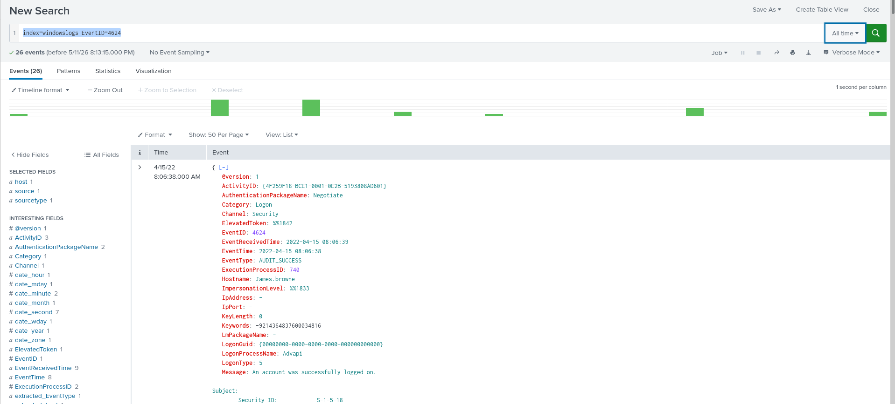

---

# Logical Operators

Splunk also supports standard logical operators:

* AND
* OR
* NOT
* IN

These allow multi-condition filtering.

---

# Investigating Specific Network Activity

Suppose we want to isolate traffic involving a particular host and service.

## PAYLOAD

```spl
index=windowslogs DestinationIp=172.18.39.6 DestinationPort=135
```

This filters events involving:

* destination IP: `172.18.39.6`
* destination port: `135`

Returned:

**4 events**

Why port 135 matters:

Port 135 commonly relates to:

* RPC communication
* Windows remote service interaction
* potential lateral movement behavior

That makes it interesting from a defender’s perspective.

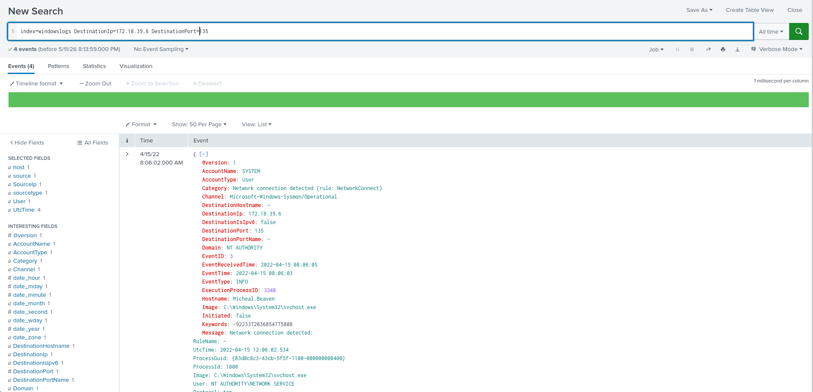

---

# Host-Specific Source IP Analysis

Now let’s narrow activity further.

## PAYLOAD

```spl
index=windowslogs Hostname=Salena.Adam DestinationIp=172.18.38.5
| stats count by SourceIp
```

Breakdown:

First:

```spl
index=windowslogs Hostname=Salena.Adam DestinationIp=172.18.38.5
```

Filters events involving:

* host `Salena.Adam`
* destination `172.18.38.5`

Then:

```spl
| stats count by SourceIp
```

Groups matching events by source IP and counts occurrences.

This transforms raw logs into summarized intelligence.

Highest result:

**172.90.12.11**

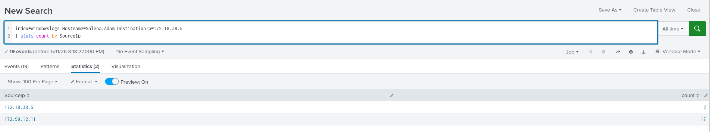

---

# Wildcard Searches

Wildcards become useful when exact values are unknown.

Example:

## PAYLOAD

```spl
index=windowslogs cyber*
```

This searches for terms beginning with:

**cyber**

Result:

**12256 events**

Meaning the wildcard matched the full dataset scope here.

Wildcards are useful for:

* IOC family matching
* filename hunting
* partial string searches
* process pattern discovery

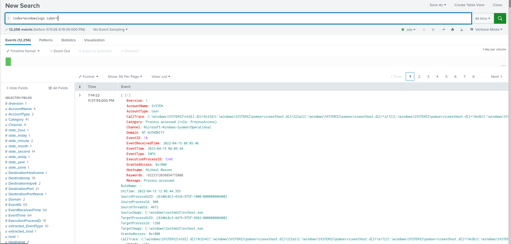

---

# Order of Evaluation in SPL

One subtle but important SPL behavior:

**OR takes precedence over AND**

Example:

```spl
alice AND bob OR charlie
```

Splunk evaluates this as:

```spl
alice AND (bob OR charlie)
```

This can dramatically alter results if misunderstood.

The operator with the **lowest priority**:

**AND**

Parentheses should always be used for complex hunting logic.

---

# Filtering Results in SPL

By this point, we already know how quickly raw event streams become overwhelming.

Enterprise environments generate massive telemetry continuously, and hunting for anomalies without filtering is basically self-inflicted suffering.

This is where SPL filtering commands become essential.

Rather than manually digging through thousands of events, we refine datasets step by step.

---

# The `fields` Command

The `fields` command allows analysts to explicitly include or exclude fields from search results.

This improves:

* readability
* investigation speed
* focus during triage

Instead of showing every extracted field, we only surface what matters.

## PAYLOAD

```spl
index=windowslogs
| fields Domain SourceProcessId TargetProcessId
```

Breakdown:

```spl
index=windowslogs
```

Loads the Windows event dataset.

Then:

```spl
| fields Domain SourceProcessId TargetProcessId
```

Restricts visible output to:

* `Domain`
* `SourceProcessId`
* `TargetProcessId`

This is incredibly useful when dealing with noisy event records containing dozens of irrelevant fields.

Result:

**Highest SourceProcessId: 9496**

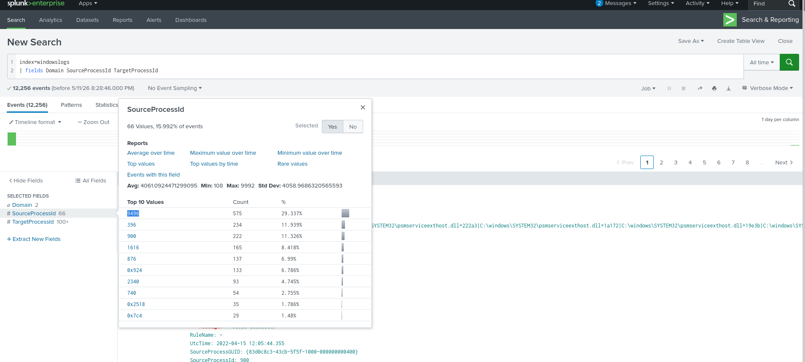

---

# Why Process IDs Matter

Process IDs are highly useful in endpoint investigations.

They help analysts:

* track parent-child execution relationships
* reconstruct process trees
* identify suspicious process spawning
* correlate endpoint behavior

Example:

If PowerShell launches cmd.exe, process relationships can reveal execution flow immediately.

---

# The `regex` Command

Exact string matching is useful—but sometimes insufficient.

This is where regular expressions become powerful.

Splunk supports **PCRE (Perl Compatible Regular Expressions)**, allowing pattern-based filtering.

---

# Registry Pattern Matching

In this case, we wanted to locate registry-related objects ending with:

`Manager`

## PAYLOAD

```spl
index=windowslogs
| regex TargetObject="Manager$"
```

Breakdown:

```spl
TargetObject="Manager$"
```

The `$` symbol means:

**end of string**

So this query matches values whose final text is exactly:

`Manager`

Result:

**HKLM\SOFTWARE\Microsoft\SecurityManager**

This is especially useful for:

* registry hunting
* persistence investigations
* malware artifact analysis
* inconsistent string matching

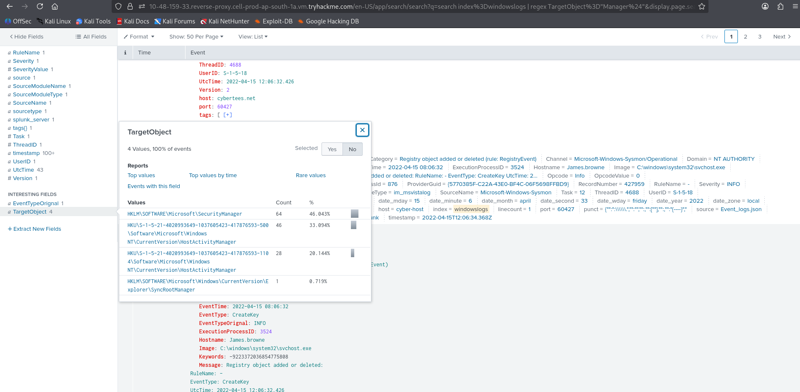

---

# Structuring Results for Investigation

Filtering reduces noise.

Structuring improves readability.

Raw logs are terrible for incident storytelling.

Structured output helps analysts quickly understand event flow.

---

# The `table` Command

The `table` command creates clean, readable output using only selected fields.

This is one of the most useful commands during investigations.

## PAYLOAD

```spl
index=windowslogs
| table EventID AccountName AccountType
```

This displays only:

* EventID
* AccountName
* AccountType

Result:

**First AccountName: SYSTEM**

This is far cleaner than reading raw event blobs.

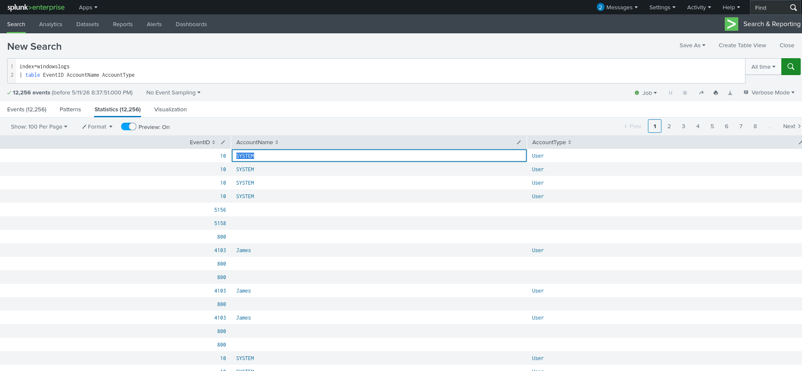

---

# Why Structured Tables Matter

Tables are useful for:

* timeline analysis
* investigation reporting
* stakeholder communication
* correlation review

A readable table is far more useful than scrolling raw XML-like event data.

---

# Reversing Timeline Order

Splunk usually displays newer events first.

But sometimes investigations require chronological order.

That’s where `reverse` helps.

## PAYLOAD

```spl
index=windowslogs
| table EventID AccountName AccountType
| reverse
```

This flips event ordering.

Result:

**First EventID: 800**

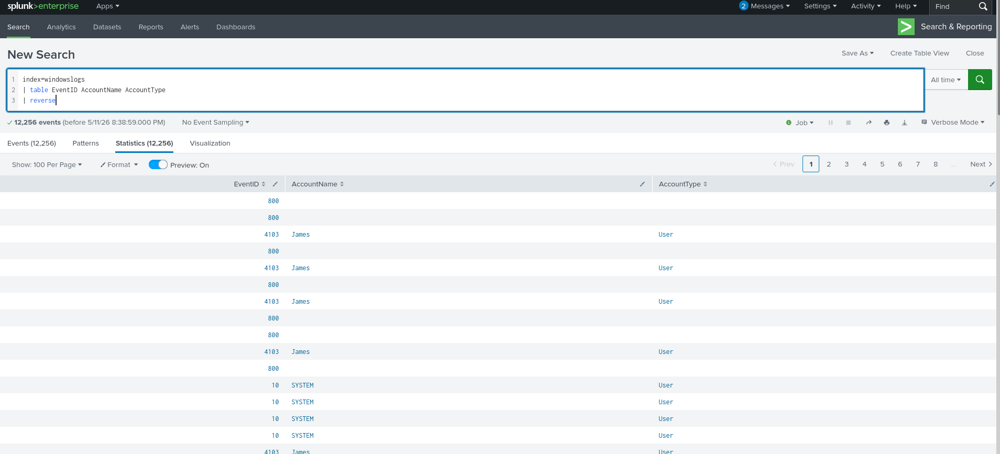

---

# Why Chronological Reconstruction Matters

Attack investigations often follow sequence.

Example:

1. Initial access
2. Authentication
3. Process execution
4. Credential dumping
5. Registry persistence
6. Lateral movement

Chronology makes attack flow obvious.

---

# Timeline-Based Process Investigation

Now let’s investigate process execution history.

## PAYLOAD

```spl
index=windowslogs EventID=1
| table _time ParentProcessId ProcessId ParentCommandLine CommandLine
| reverse
```

Breakdown:

```spl
EventID=1
```

Focuses on process creation telemetry.

Then:

```spl
| table
```

Structures the output.

Finally:

```spl
| reverse
```

Shows oldest events first.

Displayed fields:

* timestamp
* parent process ID
* process ID
* parent command line
* child command line

This is excellent for reconstructing execution chains.

---

# Credential Discovery via Command-Line Visibility

During this timeline investigation, a credential appeared directly in process arguments.

Discovered password:

**paw0rd1**

This is exactly why defenders love command-line logging.

Attackers frequently expose:

* plaintext passwords
* execution arguments
* malicious scripts
* tool usage
* automation commands

Visibility here can dramatically accelerate investigations.

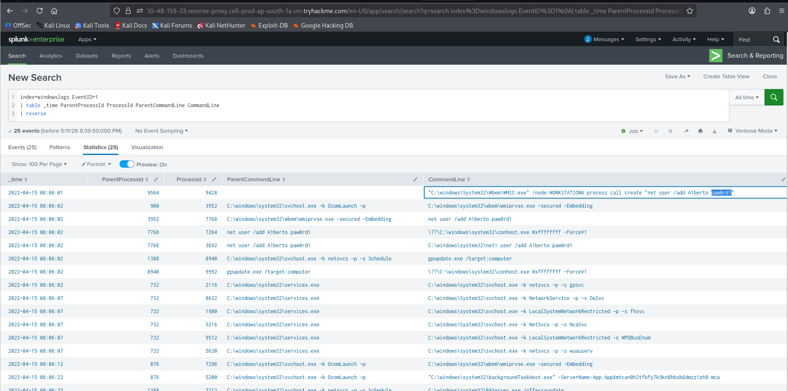

---

# Transforming Commands

Filtering narrows datasets.

Transforming commands summarize them.

Instead of thousands of raw rows, transforming searches create:

* statistics
* trends
* ranked outputs
* intelligence summaries

Common examples:

* `top`
* `stats`
* `chart`
* `timechart`
* `rare`

---

# Frequency Analysis with `top`

The `top` command identifies frequently occurring field values.

Useful for spotting dominant patterns.

## PAYLOAD

```spl
index=windowslogs EventID=1
| top Image
```

Breakdown:

Focus on:

```spl
EventID=1
```

(process creation telemetry)

Then:

```spl
| top Image
```

Returns the most common executable image values.

Result:

```text
C:\Windows\System32\BackgroundTransferHost.exe
```

This helps establish behavioral baselines.

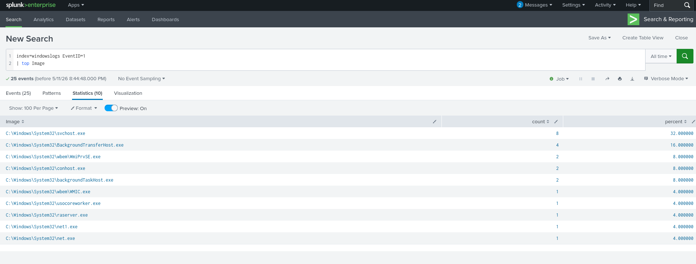

---

# Why Frequency Analysis Matters

Normal recurring binaries:

* explorer.exe
* svchost.exe
* chrome.exe

Potentially suspicious recurring binaries:

* powershell.exe
* cmd.exe
* certutil.exe
* rundll32.exe
* mshta.exe

Frequency often reveals behavioral patterns quickly.

---

# Geolocation Enrichment with `iplocation`

Context matters.

IP addresses alone are not very informative.

Splunk’s `iplocation` command enriches IP data with geographic metadata.

## PAYLOAD

```spl
index=windowslogs
| iplocation SourceIp
| stats count by Region
```

Breakdown:

```spl
| iplocation SourceIp
```

Enriches IP addresses.

Then:

```spl
| stats count by Region
```

Summarizes event counts geographically.

Result:

**California**

Geolocation enrichment is useful for:

* suspicious foreign access
* impossible travel investigations
* cloud-origin traffic review
* VPN anomaly analysis

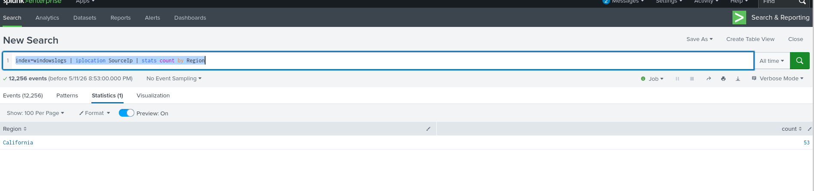

---

# Risk-Based Lookup Enrichment

External lookup tables add contextual intelligence.

This is hugely valuable in production SOC environments.

## PAYLOAD

```spl
index=windowslogs
| lookup image_riskscore Image OUTPUT RiskScore
| stats count by Image RiskScore
| sort - RiskScore
```

Breakdown:

```spl
| lookup
```

Matches process image names against an external risk database.

Then:

```spl
| stats
```

Aggregates the results.

Finally:

```spl
| sort - RiskScore
```

Shows highest-risk entries first.

Result:

```text
C:\Windows\System32\WindowsPowerShell\v1.0\powershell.exe
```

This makes sense—PowerShell is frequently abused for offensive activity.

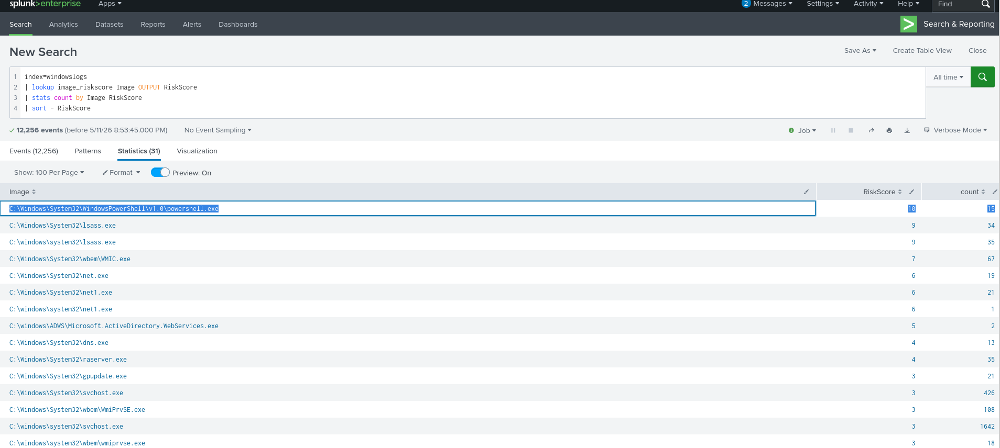

---

# Why Lookups Matter in Real SOC Operations

Lookups commonly provide:

* IOC intelligence
* malware reputation
* user role context
* asset classification
* vulnerability severity
* business criticality mapping

Without enrichment, logs are just raw data.

With enrichment, they become actionable intelligence.

---

# Anomaly Detection with SPL

Not every malicious event screams for attention.

Some of the most interesting threats hide inside what initially appears to be legitimate activity.

A valid VPN login.
A known employee account.
A familiar IP range.
A routine process.

This is why anomaly detection matters.

Instead of asking:

**“Is this explicitly malicious?”**

we ask:

**“Is this behavior unusual?”**

That shift is where threat hunting becomes significantly more effective.

---

# Detecting Outliers by Country

Imagine reviewing a VPN dataset containing thousands of login events.

Each record contains:

* login timestamp
* username
* source IP
* source country

At first glance, nothing looks suspicious.

But what if a user who always logs in from one region suddenly appears from a completely different country?

That is exactly what we’re hunting for.

## PAYLOAD

```spl
index=vpnlogs
| eventstats count as logins_by_user by user
| eventstats count as logins_by_user_country by user src_country
| eval country_freq=logins_by_user_country/logins_by_user
| where country_freq < 0.1
| table _time user src_ip src_country country_freq
```

Let’s break this down.

---

# Step 1: Count Total Logins Per User

```spl
| eventstats count as logins_by_user by user
```

This calculates:

**Total login events per user**

Example:

If user `kbrown` logged in 200 times:

```text
logins_by_user = 200
```

Unlike `stats`, `eventstats` preserves raw events while appending calculated values.

That makes it perfect for enrichment-style analysis.

---

# Step 2: Count User Logins Per Country

```spl
| eventstats count as logins_by_user_country by user src_country
```

Now we calculate:

**How many times each user logged in from each country**

Example:

If `kbrown` logged in only once from Japan:

```text
logins_by_user_country = 1
```

---

# Step 3: Calculate Behavioral Frequency

```spl
| eval country_freq=logins_by_user_country/logins_by_user
```

This creates a behavioral ratio.

Example:

```text
1 / 200 = 0.005
```

Meaning:

That country accounts for only **0.5%** of the user’s login behavior.

That’s interesting.

---

# Step 4: Filter Rare Behavior

```spl
| where country_freq < 0.1
```

This keeps only behaviors occurring less than 10% of the time.

That threshold defines anomaly sensitivity.

Lower threshold:

* stricter detections
* fewer false positives

Higher threshold:

* noisier results
* broader detection

---

# Step 5: Investigation-Friendly Output

```spl
| table _time user src_ip src_country country_freq
```

Creates readable analyst output.

Instead of messy raw events, we now get structured suspicious login candidates.

Result:

Outlier user:

**jsmith**

Anomalous country:

**JP**

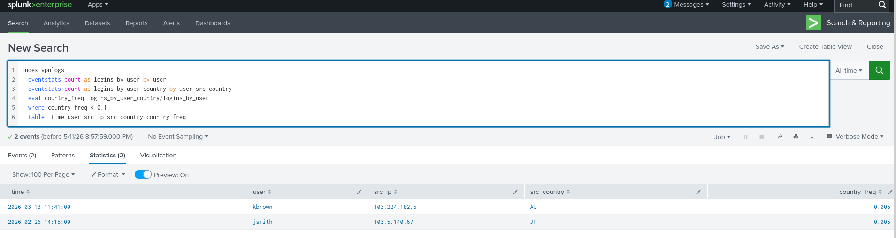

---

# Why This Matters

Traditional rule-based detection might ignore:

“Valid user successfully authenticated.”

Behavioral detection asks:

“Why is this user suddenly authenticating from Japan?”

That context changes everything.

---

# Detecting Suspicious Login Hours

Geographic anomalies are useful.

But attackers can also reveal themselves through strange timing.

Example:

An employee usually logs in around:

**1 PM**

Then suddenly authenticates at:

**3 AM**

That deserves attention.

---

## PAYLOAD

```spl
index=vpnlogs
| eval hour=tonumber(strftime(_time, "%H")) + tonumber(strftime(_time, "%M"))/60
| eventstats avg(hour) as typical_hour stdev(hour) as stdev_hour by user
| eval zscore=abs(hour - typical_hour) / stdev_hour
| where zscore > 3
| eval hour=round(hour, 2), typical_hour=round(typical_hour, 2)
| eval stdev_hour=round(stdev_hour, 2), zscore=round(zscore, 2)
| table _time user src_ip src_country hour typical_hour stdev_hour zscore
| sort - hour_zscore
```

This is practical statistical anomaly hunting.

---

# Step 1: Convert Time into Numeric Hours

```spl
| eval hour=tonumber(strftime(_time, "%H")) + tonumber(strftime(_time, "%M"))/60
```

Examples:

* 13:30 → 13.5
* 18:15 → 18.25
* 03:00 → 3.0

Why?

Because statistical analysis requires numeric values.

---

# Step 2: Learn Normal Login Behavior

```spl
| eventstats avg(hour) as typical_hour stdev(hour) as stdev_hour by user
```

This calculates:

* average login hour
* standard deviation

Example:

```text
typical_hour = 13.5
stdev_hour = 0.8
```

Meaning:

User normally logs in around **1:30 PM**, with relatively predictable behavior.

---

# Step 3: Calculate Z-Score

```spl
| eval zscore=abs(hour - typical_hour) / stdev_hour
```

Z-score measures anomaly severity.

Interpretation:

* 1 → slightly unusual
* 2 → notable
* 3+ → highly suspicious

Example:

Normal:

```text
13.5
```

Observed:

```text
3.0
```

That’s a major deviation.

---

# Step 4: Keep Only Strong Outliers

```spl
| where zscore > 3
```

This aggressively reduces noise.

Only statistically significant anomalies survive.

---

# Step 5: Investigation Output

```spl
| table
```

Creates structured review output for analysts.

---

# Result

Suspicious user:

**njackson**

Observed login:

**3 AM**

That is highly abnormal compared to baseline behavior.

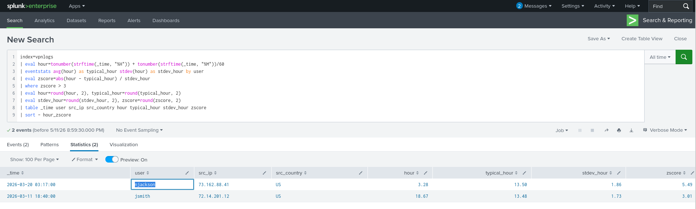

---

# Why Statistical Detection Is Smarter

Naive rule:

> Alert on every 3 AM login

Problem:

Night-shift employees trigger endless false positives.

Behavioral detection instead asks:

> Is 3 AM unusual for THIS specific user?

That’s significantly more intelligent.

---

# Real-World Takeaways

This room reinforces practical SOC investigation workflows.

---

## Search & Filtering

Useful for:

* authentication review
* IOC hunting
* endpoint triage
* log scoping

Commands used:

* search
* operators
* fields
* regex

---

## Structuring

Useful for:

* timelines
* reporting
* investigation readability

Commands used:

* table
* reverse

---

## Transforming

Useful for:

* baselining
* summarization
* pattern discovery

Commands used:

* top
* stats
* chart
* timechart

---

## Enrichment

Useful for:

* contextual intelligence
* business-aware detection
* suspicious origin analysis

Commands used:

* iplocation
* lookup

---

## Behavioral Detection

Useful for:

* compromised account hunting
* insider threat detection
* VPN anomaly analysis
* unusual activity detection

Commands used:

* eventstats
* eval
* where
* statistical logic

---

# Final Thoughts

Splunk SPL is far more than just query syntax.

It is investigative thinking translated into search logic.

The real shift happens when you move from:

**“I have logs.”**

to:

**“I understand what happened.”**

That’s where analysts become hunters.

---


